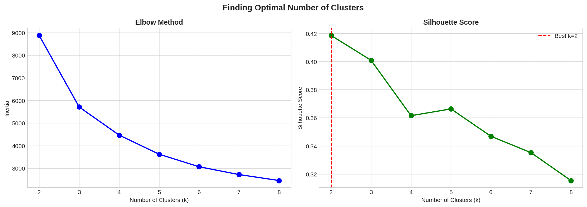
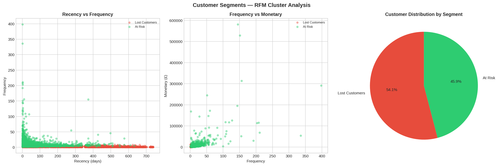
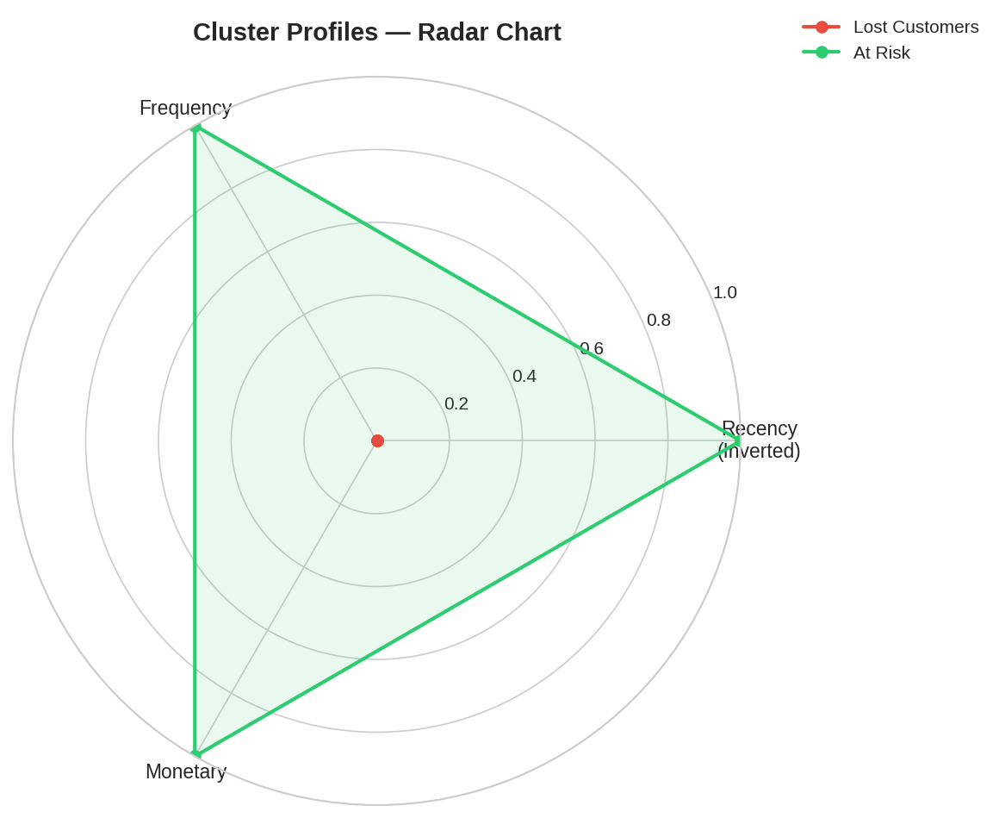
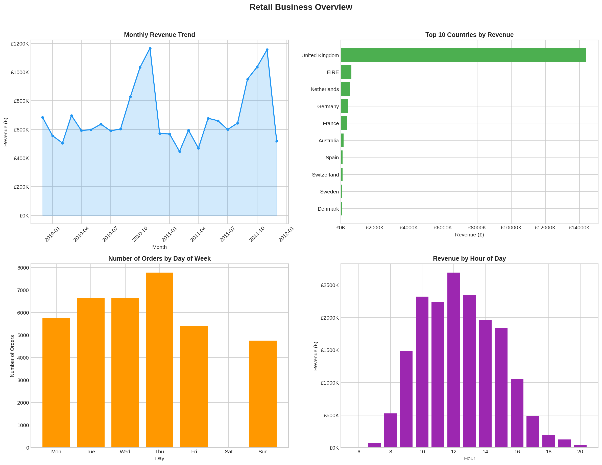
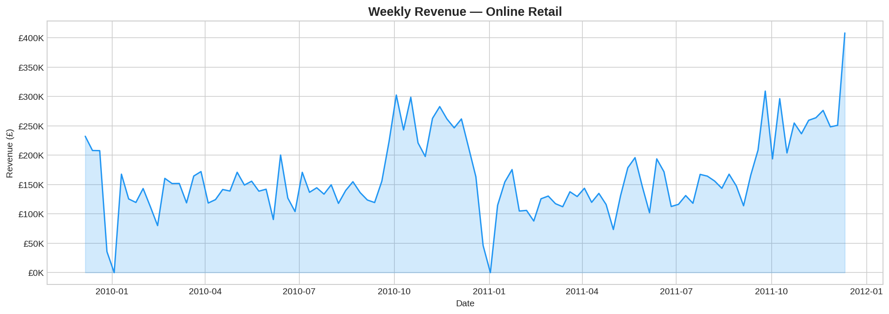
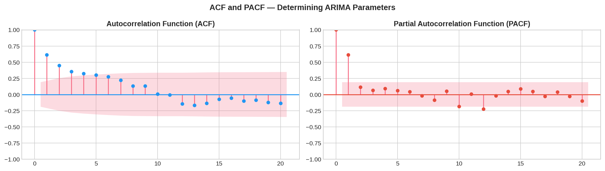
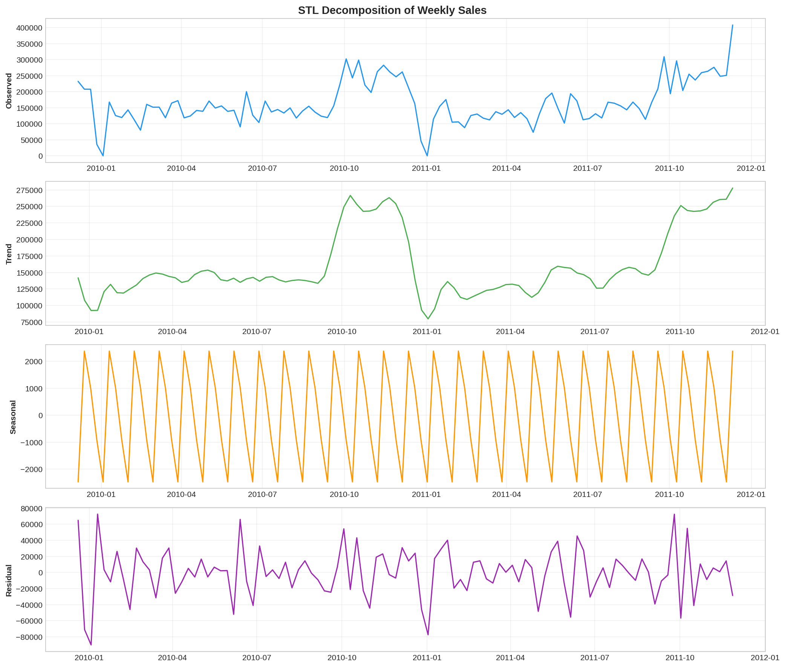
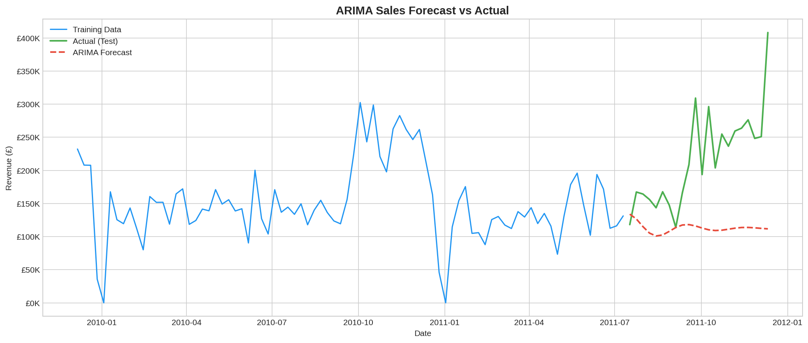
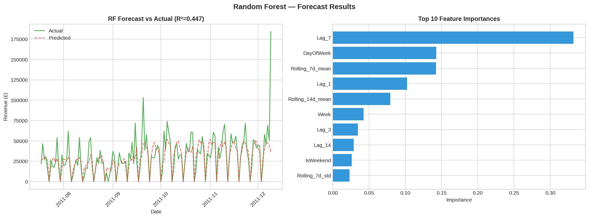

# Customer Segmentation & Sales Forecasting

This project was about understanding two things that every retail business 
cares about — who are the customers, and what's going to sell next.

I used the Online Retail II dataset (UCI/Kaggle) — around 1 million 
transactions from a UK online store between 2009-2011. I wanted to apply 
the RFM + clustering approach I read about during my coursework, but on 
real transactional data instead of a cleaned-up sample dataset.

---

## Part 1 — Who are our customers? (RFM + K-Means)

For every customer, I calculated:
- Recency — how many days since their last order
- Frequency — how many orders they've placed
- Monetary — total amount spent

The raw values were quite skewed (a few customers spend way more than 
others), so I log-transformed Frequency and Monetary before scaling and 
clustering.

To pick the number of clusters, I checked both the Elbow method and 
Silhouette scores:

Here's how the customers split up:

Once I had the segments, I labeled them based on their RFM profile — 
Champions (recent + frequent + high spend), Loyal Customers, At Risk, 
New/Occasional, and Lost customers. Each group needs a different kind of 
marketing — Champions get rewarded, At Risk customers get win-back offers, 
and so on.

---

## Part 2 — Sales Forecasting

First, some EDA on the overall business:

### Checking if the series is stationary

I ran an ADF test, then used ACF/PACF plots to figure out reasonable 
ARIMA parameters:

I also did an STL decomposition to separate out the trend, seasonality, 
and the leftover noise:

### ARIMA forecast

### Random Forest forecast

For shorter-term forecasting I tried a different approach — created lag 
features (last 1, 2, 3, 7, 14 days) plus rolling averages, and trained a 
Random Forest regressor on these instead.

---

## What I noticed

ARIMA captured the overall long-term trend better, but Random Forest with 
lag features did better on short-term/day-to-day predictions — probably 
because it could pick up on recent patterns that ARIMA averages out. If I 
were doing this for an actual business, I'd probably use ARIMA for monthly 
planning and the RF model for weekly operational forecasts.

---

## Files here

- `customer_segmentation_sales_forecasting.ipynb` — full notebook with all the code
- `requirements.txt` — libraries used
- the `.png` files — all charts from the notebook

---

## Running this yourself
